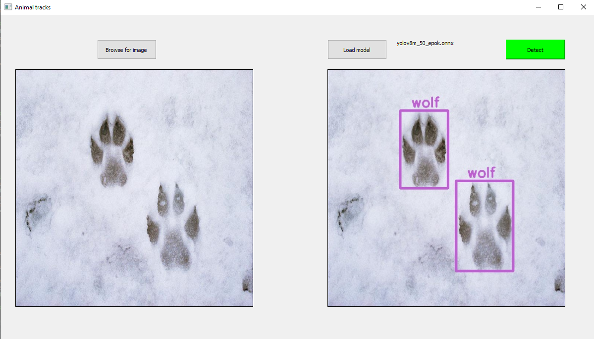

# Recognizing Animals by Prints

## Overview
This project aims to recognize six different animals based on their prints:

- Beaver
- Boar
- Deer/Roe Deer
- Hare (Zając)
- Lynx
- Wolf

## Models Directory
In the `models` directory, there are two different YOLOv8 models trained on 20 or 50 epochs.

